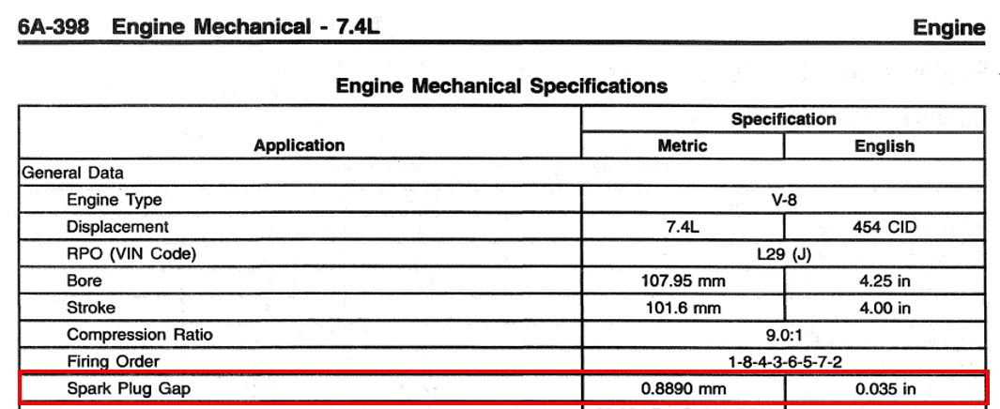
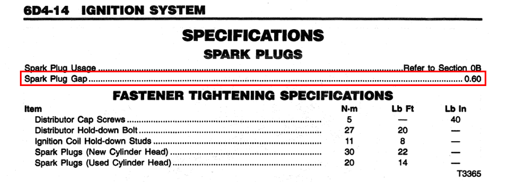
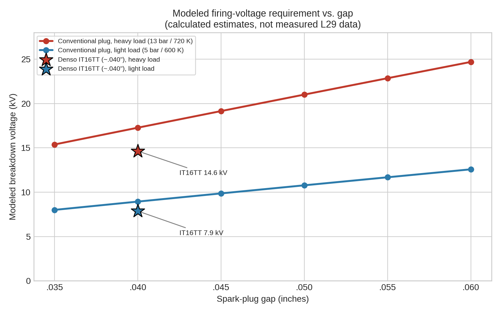
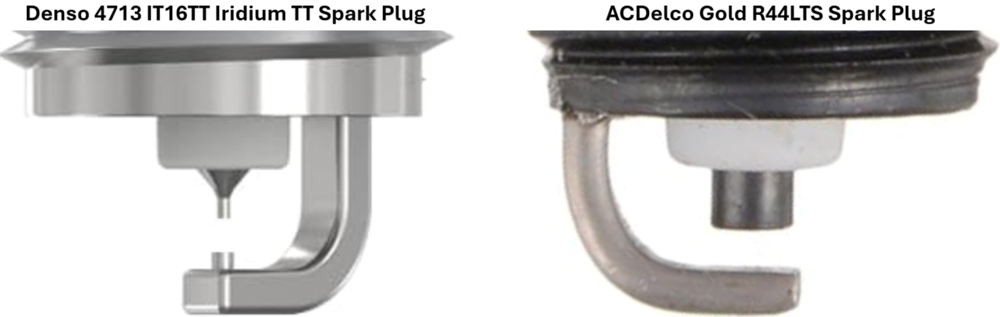
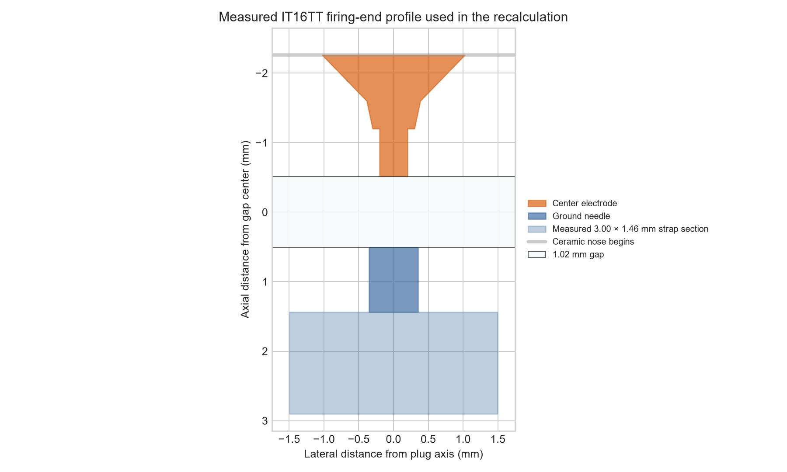
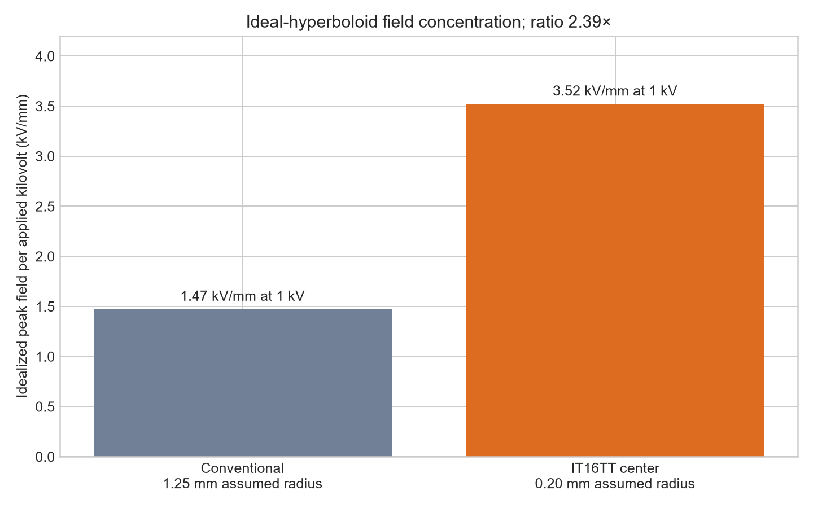
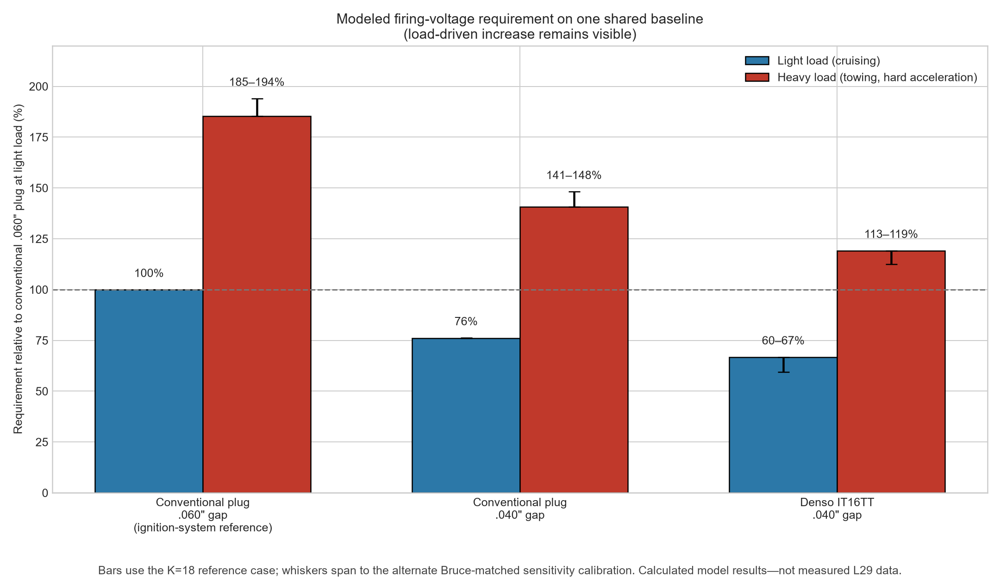
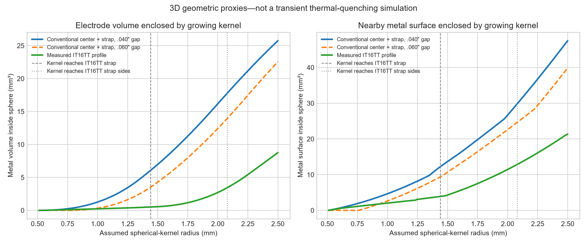
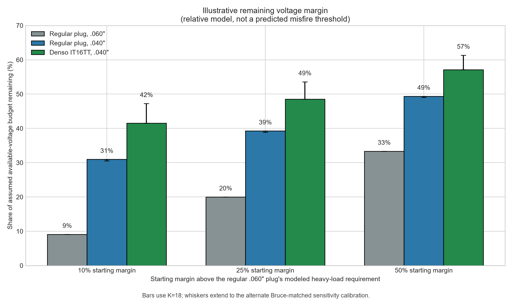

# Spark-Plug Gaps, Electrode Design & Selection Beyond the OEM Part Number

## Gap, Electrode Design, Firing Voltage, and Why the Rest of the Ignition System Matters

### Key takeaways

- **Gap and electrode design together:** Using the modeling explained later in this article, going from the conventional reference at .060 inch to the IT16TT at .040 inch requires approximately **33–41% less firing voltage during cruising and 36–42% less during heavy-load conditions**. Most of the modeled reduction comes from closing the gap; the remainder comes from the assumed fine-tip geometry. These are calculated ranges, not ignition-scope measurements from an L29.
  - **Gap:** Depending on which of the two models is used, reducing the gap from .060 to about .040 inch lowers the calculated firing-voltage requirement by approximately **24–30%**. That leaves meaningfully more reserve in the coil, cap, rotor, wires, and insulation. The same percentage reduction saves more actual voltage during heavy load and hard acceleration, when firing-voltage demand is highest.
  - **Electrode design:** At the same gap, the breakdown model estimates that the IT16TT's fine firing geometry requires approximately **12–24% less voltage** than the conventional reference. A separate idealized calculation helps explain why: the small center tip concentrates the local electric field about 2.39 times as strongly as the assumed conventional electrode. That field-strength ratio is not itself a voltage-saving percentage; it simply shows why tip shape matters. The full calculations and sensitivity cases are explained later.
- **Reserve and durability:** Requiring less firing voltage leaves more of the ignition system's existing voltage capability in reserve for the conditions that demand it most—hard acceleration, towing, climbing grades, high cylinder pressure, and the effects of aging, moisture, or worn secondary-ignition parts. It does not create more coil energy or engine power; it simply asks less of the system to start each spark. Separately, the fine electrode geometry places less metal around the developing flame kernel, which is consistent with lower early heat loss and better kernel development under marginal conditions, although that effect was not measured on an L29. Holding the gap and tip shape matters too, because the first .005 inch of gap growth adds roughly 9–11% to a regular plug's modeled voltage demand. That is where the fine-wire precious-metal design may provide a longer-term advantage.
- **GM precedent:** GM TSB #03-06-04-060B documents GM moving a number of later V8s to an iridium-tip plug with a factory .040-inch gap, and it attributes the smaller gap to the different firing-tip design. It does not cover the L29, but it shows GM itself pairing a fine-wire tip with a tighter gap instead of treating .060 inch as a given.
- **L29 factory-spec discrepancy:** The *1997 Chevrolet Light Duty CK Truck Service Manual, Volume 1-1* contains conflicting spark-plug-gap specifications for the L29 7.4L. The engine-mechanical specifications list .035 inch, while the ignition-system specifications list .060 inch. That inconsistency is another reason I do not think .060 inch should automatically be treated as the only meaningful reference point when considering plug design and ignition-system demand.
- **Limits:** All of these numbers are calculated estimates, not measured L29 data. A lower-demand plug cannot fix a worn cap, rotor, or wires—or unrelated problems such as poor fuel delivery. The IT16TT has the correct basic physical fit for the L29: 14 mm thread, 17.5 mm reach, tapered seat, and a 16 mm hex. Its Denso heat range also matches the heat-range-16 plugs that Denso cross-references from the R44LTS. In addition, the DensoProducts.com application catalog directly lists DEN4713/IT16TT as compatible with the selected 1997 GMC K2500 Suburban SLE, specifying a .040-inch gap and eight plugs. DensoProducts.com is a retailer application guide rather than Denso's corporate site, so I identify it separately from Denso's official technical and cross-reference pages.

### What this means for my L29

For me, the IT16TT at its approximately .040-inch factory gap is a well-supported choice for the L29. It has the correct dimensions and heat range and is directly listed for my selected 1997 K2500 Suburban application. The modeling does not promise additional horsepower, but it consistently indicates lower firing-voltage demand, more secondary-ignition reserve under heavy load, and less metal surrounding the developing flame kernel. That combination—not any claim of a "magic" spark plug—is the reason I chose it.

*This opening chart compares each plug with the conventional .060-inch reference under the same load. Rounded to whole percentages, the IT16TT at .040 inch requires 60–67% as much modeled firing voltage during cruising and 58–64% as much under heavy load. Those correspond to the separately rounded 33–41% and 36–42% reductions stated in the takeaway. These are calculated results, not measured L29 data. A later chart uses one common baseline so the increase in voltage demand from light to heavy load remains visible.*

## The Deeper Reading and Technical Discussion

What started out as me comparing two spark plugs turned into a much deeper look at how spark-plug gap, electrode design, cylinder pressure, temperature, and the condition of the ignition system all work together. The L29 7.4L Vortec is an especially interesting engine to look at because the factory information itself raises questions. In the 1997 service manual, the engine-mechanical specifications list a .035-inch spark-plug gap, while the ignition-system specifications later list .060 inch. That discrepancy is what originally sent me down this rabbit hole.

*1997 Chevrolet Light Duty CK Truck Service Manual, Volume 1-1. The engine-mechanical specifications list **0.035 in.**, while the ignition-system specifications list **0.060 in.** The latter is printed as “0.60,” which I assume means 0.060 in., not 0.600 in.*

I first looked at the ACDelco R44LTS as a conventional tighter-gap alternative. Then I came across the Denso IT16TT, which is already configured around a ~.040-inch gap and uses manufacturer-stated 0.4 mm iridium center and 0.7 mm platinum ground electrodes. The R44LTS represents the conventional large-electrode plug design commonly associated with the tighter-gap approach on these engines, while the IT16TT uses a much finer iridium/platinum electrode design that became far more common in later production spark plugs. At that point, the question became less about brands and more about what the plug is actually asking the ignition system to do.

Before going any further, I wanted to make sure I was at least comparing plugs with the right basic dimensions. The R44LTS uses a 14 mm thread, 17.5 mm reach, tapered seat, and 5/8-inch hex (about 15.9 mm). Denso lists the IT16TT with the same thread, reach, and seat, along with a nominal 16 mm hex—essentially the same size as 5/8 inch.

Heat-range numbers cannot be compared directly between brands because each manufacturer uses its own scale, so I checked Denso's own system instead of trying to translate the ACDelco number literally. Denso cross-references the R44LTS to T16EPR-U, IT16, and VT16, all of which use Denso heat range 16. The IT16TT is also a Denso heat-range-16 plug and has the correct 14 mm thread, 17.5 mm reach, tapered seat, and 16 mm hex. That establishes both the physical fit and the intended heat-range match. Beyond that dimensional and heat-range comparison, the DensoProducts.com vehicle catalog directly lists DEN4713/IT16TT as compatible with the selected 1997 GMC K2500 Suburban SLE, with a .040-inch gap and eight plugs required. That site is a retailer application guide rather than Denso's corporate site, but it is still a direct vehicle-application listing for this exact plug.

## Gap Is Only Part of the Story

A wider spark-plug gap can help combustion, but wider is not automatically better. The larger gap exposes more mixture to the initial discharge and can help the flame kernel get established. Under some conditions, that can improve combustion stability and even slightly increase output. The tradeoff is that firing-voltage demand rises with the gap. If the gap becomes too large to fire reliably during hard acceleration, towing, or climbing a grade, the possible combustion benefit disappears into misfire. The practical target is not the widest gap possible; it is a gap that gives useful spark exposure while still leaving adequate ignition reserve.

I put together a simple comparison showing how the voltage needed to fire a conventional plug changes with gap size under representative light-load and heavy-load conditions. I also included the IT16TT at its ~.040-inch gap using the separate calculated fine-wire adjustment discussed below, just to show where it might fall relative to the conventional plugs.

For the comparison, I used representative pre-spark conditions of about 5 bar absolute / 600 K for the light-load case and 13 bar / 720 K for the heavier-load case. Those are representative operating points, not measured L29 cylinder-pressure or temperature data. The purpose of the calculation is to compare trends as gap and load change, not to predict the exact firing voltage of my engine. The conventional rows use the Bruce empirical fit for a uniform-field air gap, adjusted for gas density. The step-by-step calculation is in Appendix A at the end of this article.

To keep the math from turning into one big apples-to-oranges comparison, I use three separate calculations for three separate questions:

1. **The uniform-field gap calculation** compares how pressure, temperature, and gap change the baseline breakdown-voltage trend. It does not represent spark-plug electrode shape.
2. **The idealized field and breakdown models** explore how assumed tip geometry might change firing-voltage demand. Their percentages are model-dependent and are not measurements of the IT16TT or the L29.
3. **The measured-profile geometry calculation** compares how much electrode metal volume and exposed surface lie near an idealized growing flame kernel. It does not calculate firing voltage, heat transfer, or combustion improvement.

| Plug / Gap          | Light Load | Heavy Load | Light Load, % of .035 LL | Heavy Load, % of .035 LL |
| ------------------- | ---------- | ---------- | ------------------------ | ------------------------ |
| Conventional .035"  | ~8.0 kV    | ~15.4 kV   | 100%                     | 192%                     |
| Denso IT16TT ~.040" | ~7.4 kV    | ~15.0 kV   | 92%                      | 187%                     |
| Conventional .040"  | ~8.9 kV    | ~17.3 kV   | 112%                     | 216%                     |
| Conventional .045"  | ~9.9 kV    | ~19.2 kV   | 123%                     | 239%                     |
| Conventional .050"  | ~10.8 kV   | ~21.0 kV   | 135%                     | 263%                     |
| Conventional .055"  | ~11.7 kV   | ~22.9 kV   | 146%                     | 286%                     |
| Conventional .060"  | ~12.6 kV   | ~24.7 kV   | 157%                     | 309%                     |

*Note: The last two columns show each value as a percentage of the conventional .035-inch light-load (LL) value. For example, 309% means 3.09 times the baseline, which is a 209% increase over that baseline. The percentages are calculated from unrounded values, so they can differ by a point from what the rounded kilovolts shown here would give.*

*The IT16TT values are calculated estimates only. There is no measured L29 data behind that row, and the fine-wire correction is intended only to illustrate the approximate modeled scale of the electrode-geometry effect, not to predict an actual firing voltage. The physical reasoning behind that adjustment, and a cross-check using a separate geometry model, are worked through in the "Electrode Design Matters Too" section below.*

*Modeled firing-voltage requirement versus gap, from the table above. The stars show the IT16TT at about .040 inch under the same two load conditions.*

The IT16TT row is different from the others. The conventional rows use gap, pressure, and temperature alone. The Denso row adds a modeled effective-gap adjustment to represent the expected benefit of its fine firing geometry; Appendix A shows how that adjustment was made. I did not just subtract one fixed percentage from the conventional .040-inch result. The breakdown relationship is nonlinear, so the percentage changes with operating conditions. That is why the estimated IT16TT value is about 17% below the conventional .040-inch value in the light-load example but about 13% lower in the heavier-load example. It is meant to show the likely direction and scale—not predict an actual L29 firing voltage.

With conventional plugs under the same operating condition, going from .035 to .060 inch raises the modeled breakdown requirement by roughly 57–60%. Across both gap and load, the comparison runs from about 8.0 kV for .035 inch in the light-load example to about 24.7 kV for .060 inch in the heavy-load example. That is about 3.1 times the voltage—but it combines two changes at once, so it should not be read as a gap-only increase.

Again, those are not measured L29 firing voltages. The useful part is the trend: opening the gap raises the required voltage, and higher cylinder pressure under load raises it again. Except for the separate adjustment used for the Denso row, this first comparison does not include detailed electrode shape.

This is where Road Trip's experience with a Sun 1115 engine analyzer really helped connect the theory to the real world. He described watching firing voltage climb quickly during a snap-throttle test and then settle back down once the engine reached a steady rpm. He also remembered marginal ignition systems that behaved perfectly well at idle and light throttle but could lose the spark once cylinder pressure increased. That is pretty much the physics showing up on a shop scope. His firsthand experience was one of the things that helped me frame the discussion around ignition reserve rather than just plug gap by itself.

## Why This Becomes Important on the L29

Before the plug fires, the ignition system has to develop enough secondary voltage for the gap to break down. That secondary circuit includes the coil secondary, coil wire, distributor cap, rotor, plug wire, and spark plug. Ideally, the first electrical breakdown happens exactly where we want it: across the spark-plug gap.

As the required firing voltage rises, the voltage has more reason to find another path through moisture, carbon tracking, cracked insulation, a worn cap or rotor, or a weak plug wire. That matters on the L29 because owners and service discussions frequently report cap and rotor trouble with the Vortec crab-cap distributor. I treat those reports as useful service experience, not quantified fleet failure data.

The broader GMT400 owner experience also seems to show a recurring preference for somewhat tighter gaps on distributor-equipped Vortec engines. Around .040–.045 inch repeatedly comes up as a commonly successful range, particularly on the L29. Some owners report smoother operation or fewer heavy-load ignition problems after moving away from .060 inch.

Those reports cannot establish the best gap by themselves, but they do line up with the direction of the voltage-demand calculations.

That does not mean .060 inch cannot work. A fresh, healthy ignition system may handle it just fine. I think the more useful way to look at it is that the larger gap spends more of the available secondary-voltage reserve. A somewhat tighter gap simply leaves more margin for heavy cylinder pressure, aging parts, moisture, and wear.

And of course, a lower-demand spark plug will not fix a bad ignition system. If the cap is tracking, the rotor is worn, or the plug wires are leaking, those problems still need to be corrected.

### A Relevant GM Iridium-Gap Change

GM TSB #03-06-04-060B, "Information on New Spark Plugs and Gapping," documents a later GM transition from platinum plugs to the ACDelco 41-985 iridium plug on a number of 4.8L, 5.3L, 5.7L LS1/LS6, and 6.0L applications.

The new plug was manufactured with a .040-inch (1.01 mm) gap, and GM instructed technicians not to alter that factory-set gap. The bulletin specifically states that the gap changed because of the different iridium firing-tip design.

The important limitation is that this bulletin does not include the L29 7.4L, L30 5.0L, or L31 5.7L Vortec engines, so I would not treat it as a direct gap specification for those engines.

I still think it is relevant to this discussion because it provides a useful GM example of a substantially smaller plug gap being adopted alongside a change in firing-end design. It also reinforces the broader point that electrode geometry and gap have to be considered together rather than treating .060 inch as universally desirable regardless of the plug being used.

## Electrode Design Matters Too

Two plugs with the same measured gap do not necessarily place the same demand on the ignition system. A conventional plug typically uses a comparatively large center electrode and a wide ground strap, while the IT16TT uses manufacturer-stated 0.4 mm iridium center and 0.7 mm platinum ground electrodes.

*Measured IT16TT firing-end profile used in the three-dimensional geometry calculation. Dimensions were scaled from side-view images using the photograph's 1.02 mm gap reference. Denso's catalog lists the nominal IT16TT gap as 1.0 mm. The measured ground-strap dimensions are approximately 3.00 mm (.118 inch) wide and 1.46 mm (.058 inch) thick.*

Those added measurements improve the flame-kernel geometry calculation later in the article because they describe the metal behind the firing faces. They do not materially change the peak-field calculation below, which was already controlled by the same assumed 0.20 mm center-tip radius and approximately 1.02 mm gap.

Gas breakdown is often discussed in Paschen-like terms because pressure, temperature, and gap distance strongly influence the voltage required to initiate a discharge. Electrode geometry adds another layer to that picture. A very small-radius firing tip concentrates the local electric field much more strongly than a broad conventional electrode, so the gas immediately around that tip can reach the conditions needed for breakdown at a somewhat lower applied voltage. That is the physical basis for expecting a fine-wire plug to require less firing voltage than a larger-electrode plug at the same nominal gap.

### Putting a Number on Field Concentration

To get a feel for how big the geometry effect could be, I started with a standard point-to-plane approximation for the peak electric field at a sharp tip, which depends on the tip radius, the gap, and the applied voltage. That shortcut is least accurate when the gap is close to the tip radius, so I also solved the same idealized geometry exactly. At the measured 1.02 mm gap, I compared a conventional ~2.5 mm center electrode (assumed tip radius about 1.25 mm) against the IT16TT's 0.4 mm iridium center electrode (assumed tip radius about 0.2 mm). The formulas and worked steps are in Appendix B. The results, per volt applied, were:

| Electrode | Tip radius r | Rough formula (per volt) | Exact solution (per volt) | Relative to conventional |
|---|---|---|---|---|
| Conventional (~2.5 mm center) | 1.25 mm | ~1.4 mm⁻¹ | 1.471 mm⁻¹ | 1.0× |
| IT16TT iridium (0.4 mm center) | 0.2 mm | ~3.3 mm⁻¹ | 3.520 mm⁻¹ | 2.39× |

*Exact ideal-hyperboloid values at the measured 1.02 mm gap. The rough estimates remain in the table above for comparison but are not plotted.*

In practical terms, 10 kV across the idealized gap would produce a peak tip field of about 14.7 kV/mm on the conventional reference and 35.2 kV/mm on the fine-wire reference. The fine tip reaches a given local peak field strength at a lower applied voltage.

**This is not a prediction that the IT16TT needs 2.39 times less voltage.** Breakdown in a running engine depends on how the field is distributed across the whole gap, not just on the peak at the tip, and on cylinder pressure, turbulence, mixture composition, electrode temperature, and polarity. The measured taper lengths affect the larger field distribution but do not enter this closed-form hyperboloid-tip calculation.

The 2.39× idealized field-concentration result tells us the fine tip matters, but it does not tell us how much firing voltage is actually saved. For that, we need a different comparison.

### Modeled Comparison: IT16TT vs. a Conventional Plug

To compare the two plugs as fairly as I could, I ran both through the same breakdown model. I kept the gas properties, gap, load conditions, and breakdown settings the same. The only thing I changed was electrode geometry:

- **Conventional plug:** 1.25 mm center-electrode tip radius facing a flat ground strap.
- **Denso IT16TT:** 0.2 mm center-electrode tip radius facing a 0.35 mm-radius ground tip (the 0.7 mm Twin-Tip platinum electrode).

The breakdown threshold is uncertain, so I ran the model two ways and report the results as ranges. I also focus on percentage differences rather than absolute kilovolts. For this question, the plug-to-plug comparison is more useful than pretending any one modeled voltage is exact. Appendix C has the full assumptions and limitations.

Here is the plain-English version. A "regular plug" means the same conventional large-electrode reference used in the first table. Each percentage shows how much *less* voltage the ignition system has to produce, so a larger number means an easier job for the coil, cap, rotor, and wires. "Cruising" represents light load. "Towing" also covers hard acceleration and climbing a grade, when cylinder pressure is high. The ranges show how much the answer moved between the two model settings.

| What changes | Cruising / light load | Towing / hard acceleration |
| --- | --- | --- |
| Keep the .040" gap, but switch from a regular plug to the IT16TT (the plug design alone) | 12–22% less voltage | 15–24% less voltage |
| Go from a regular .060" plug to the IT16TT at .040" (both changes together) | 33–41% less voltage | 36–42% less voltage |
| Keep a regular plug, but close the gap from .060" to .040" (the gap alone) | about 24% less voltage | about 24% less voltage |

For anyone following the model details, the lower reduction in each range comes from the K = 18 reference case. The higher reduction comes from the alternate Bruce-matched sensitivity case. I show both endpoints instead of averaging them because the alternate setting is useful for seeing how sensitive the answer is, but I do not consider it equally physical.

As an example, if a regular plug at .060" needed 20,000 volts at a given moment, the IT16TT at .040" would need roughly 12,000 to 13,000 volts in this model.

*This chart uses one shared baseline: the conventional .060-inch plug under light load equals 100%. That is why its heavy-load bars rise well above 100% and why it looks different from the opening graphic. The opening graphic resets the conventional .060-inch plug to 100% within each load condition, making the percentage reductions easier to compare; this chart deliberately keeps the light-load baseline fixed so the large increase in voltage demand under heavy load remains visible. In both graphics, the bars use the K = 18 reference case and the whiskers extend to the alternate Bruce-matched sensitivity result. They are model comparisons, not measured L29 voltages.*

In this model, the ~.040-inch IT16TT lands in roughly the same firing-voltage neighborhood as a conventional plug gapped around .028–.034 inch, depending on load and model setting. That also agrees reasonably well with the estimated IT16TT row in the first table. The two methods are not identical, but they point to the same general scale of benefit.

For the practical question—staying with a conventional .060-inch plug or moving to the IT16TT at .040 inch—the modeled reduction is roughly 33–42%. About 24 percentage points come from the tighter gap. The remainder comes from the fine-wire geometry, which is the less certain part. The first table gives a slightly larger 29–30% gap-only reduction because its uniform-field equation responds to gap somewhat differently than the curved-tip model used here.

Three limitations are worth stating plainly:

1. **The result depends on the assumed tip shapes.** Varying the conventional plug's assumed tip radius from 0.75 to 2.0 mm moved the same-gap reduction between about 7% and 28%. Also varying the IT16TT's assumed tip radii (0.15–0.25 mm center, 0.25–0.35 mm ground) widens that to roughly 4% to 35%. If the conventional plug's ground-strap edge is modeled as slightly rounded rather than flat, the IT16TT advantage shrinks toward the low end of that span.
2. **The ground electrode does not add field enhancement the way I first assumed.** Compared with a flat ground, a small ground tip at the same gap actually lowers the field at the center tip (from about 3.5 to about 2.6 per mm per volt) while creating a second, weaker concentration at its own tip (about 1.7 per mm per volt). Whatever the 0.7 mm platinum ground electrode contributes is more likely to come from reduced flame-kernel quenching and better wear behavior than from additional field concentration.
3. **The model still leaves out the in-cylinder complexity.** It does not include turbulence, mixture composition, electrode temperature, or polarity effects, and the load points are representative rather than measured L29 data. Only an ignition-scope measurement on a real engine could confirm the size of the benefit.

### Polarity, Temperature, and the Center Electrode

In many conventional inductive ignition systems, the center electrode is negative relative to the ground strap during the firing pulse. Polarity depends on the coil and wiring, though, and I have not measured it on this L29. The center electrode also normally runs hotter than the ground electrode. Both polarity and temperature can affect breakdown, but I have not tried to assign them a number here.

The much clearer effect is geometric: the tiny center-electrode radius concentrates the local electric field at its tip. That makes the IT16TT's 0.4 mm iridium center electrode the likely source of much of its same-gap voltage advantage. The model estimates the overall difference, but it cannot tell us exactly how much credit belongs to each part of the firing end. That remains a reasonable interpretation, not a measured result from an L29.

Separately, the smaller electrodes may also reduce obstruction and the metal surface available to draw heat from the developing flame kernel. A fine 0.7 mm ground electrode presents less physical material around the initial spark region than a conventional wide ground strap, although I can't say how significant that difference would be on an L29.

Iridium and platinum matter here because of durability, not because they are better electrical conductors than copper. Their resistance to heat and electrical erosion allows the electrodes to be made extremely small while still holding their shape and gap over time. In other words, the fine geometry provides the electrical advantage, while the precious metals make that geometry practical and durable.

## Other Practical Benefits of the Fine-Wire Design

Lower firing-voltage demand is only one part of the comparison. A fine-wire design also changes how much metal surrounds the initial spark. I first estimated that from the two firing faces alone. After measuring the actual IT16TT, I replaced that simple flat-disk comparison with a 3D profile that includes the straight center tip, both tapers, the ground needle, the shoulder behind the center tip, and the ground strap. Appendix D contains the supporting math and assumptions.

### Less Metal Around the Developing Spark

Once the spark jumps the gap, the flame kernel starts small and grows. Nearby electrode surfaces can pull heat from it, while the electrode itself occupies space into which the kernel might otherwise expand. Those are related but not identical effects, so I calculated two separate geometric quantities inside an idealized sphere centered in the gap:

- **Enclosed metal volume**, as a geometric obstruction proxy.
- **Enclosed metal surface**, as a geometric proxy for nearby surface available to exchange heat with the hot gas.

For the IT16TT, I used the measured 0.69 mm straight 0.4 mm-diameter center tip, the 0.40 and 0.66 mm tapered sections behind it, the 0.93 mm-long 0.7 mm ground needle, and the ground-strap face 1.44 mm from the center of the gap. The strap thickness converts to approximately 1.46 mm (.058 actual inch), putting its back face about 2.90 mm from the gap center. A separate side-profile scale—1.64 PowerPoint inches for the 1.02 mm gap and 4.82 inches for the visible strap width—gives a strap width of approximately 3.00 mm (.118 actual inch). The R44LTS has a similarly shaped ground strap but no projecting ground needle, so the corrected conventional reference uses one 2.5 mm-diameter cylindrical center electrode facing a rectangular strap with the same approximately 3.00 mm width and 1.46 mm thickness used for the IT16TT strap. The conventional strap face begins directly at the plug gap.

> **What is being compared:** The IT16TT uses its measured fine-tip and strap profile at approximately .040 inch. The corrected R44LTS-style reference uses the assumed 2.5 mm-diameter conventional center electrode and a similarly shaped strap without the TT ground needle, calculated at both .040 and .060 inch. The conventional strap is assigned the measured IT16TT strap width and thickness because those dimensions were not separately scaled from the R44LTS. This is much closer to the actual physical comparison than the earlier two-cylinder reference, but the conventional center diameter and shared strap dimensions remain model assumptions rather than a complete measurement of the R44LTS.

| Kernel radius | IT16TT metal volume | Conventional volume | Less volume | IT16TT metal surface | Conventional surface | Less surface |
|---:|---:|---:|---:|---:|---:|---:|
| 0.75 mm | 0.104 mm³ | 0.242 mm³ | 56.9% | 1.115 mm² | 1.900 mm² | 41.3% |
| 1.00 mm | 0.237 mm³ | 1.262 mm³ | 81.2% | 2.039 mm² | 4.649 mm² | 56.1% |
| 1.25 mm | 0.371 mm³ | 3.452 mm³ | 89.3% | 3.077 mm² | 8.183 mm² | 62.4% |
| 1.50 mm | 0.557 mm³ | 6.974 mm³ | 92.0% | 4.291 mm² | 13.667 mm² | 68.6% |
| 2.00 mm | 2.712 mm³ | 16.181 mm³ | 83.2% | 11.443 mm² | 26.668 mm² | 57.1% |
| 2.50 mm | 8.755 mm³ | 25.746 mm³ | 66.0% | 21.333 mm² | 47.488 mm² | 55.1% |

*Three-dimensional geometric proxies, not a transient thermal-quenching simulation. The dashed line marks the approximately 1.44 mm kernel radius at which the idealized sphere first reaches the IT16TT ground strap; the dotted line marks the approximately 2.08 mm radius at which it reaches the IT16TT strap's visible sides. The IT16TT strap's back face is approximately 2.90 mm from the gap center, beyond the plotted range.*

At a 1.5 mm kernel radius, the IT16TT model contains about 92% less metal volume and 69% less metal surface than the same-gap conventional center-and-strap reference. Those percentages are not constant and should not be treated as measured advantages over an actual R44LTS. The growing sphere first surrounds the fine tips, then reaches the IT16TT ground strap. By a 2.5 mm radius, the modeled advantage is about 66% less volume and 55% less surface. That changing picture is exactly what the old firing-face-only calculation could not show.

I also reran the corrected conventional reference at the wider .060-inch gap rather than assuming that the same-gap comparison answered that question. At a 1.0 mm kernel radius, the measured IT16TT profile at .040 inch still contains about 28% less metal volume and 23% less exposed metal surface than the conventional reference at .060 inch. At a 1.5 mm radius, the differences are about 87% less volume and 60% less surface. There is an important early-radius exception: until a centered spherical kernel reaches a 0.762 mm radius—half of the .060-inch gap—it has not touched either conventional firing face, while it already intersects the closer IT16TT tips. The result is therefore not that the fine-wire .040-inch geometry is better at every instant. It is that, once the modeled kernel has grown beyond roughly 1 mm, the much smaller tips more than offset the conventional plug's wider spacing in these two geometric proxies.

That calculated reduction in nearby metal volume and surface is consistent with less electrode heat loss during early kernel growth, but it is not itself a heat-transfer measurement. Experimental literature on spark-plug electrode geometry reports that reduced interference and heat loss can improve early flame development, lean ignitability, and cycle-to-cycle stability under marginal mixture conditions. In that limited geometric sense, the IT16TT at about .040 inch remains competitive with—and through much of the modeled 1.0–2.5 mm radius range is more favorable than—the conventional reference at .060 inch, even though its absolute gap volume is smaller. The magnitude of any combustion benefit on a healthy L29 under normal load was not measured here and is likely modest. The clearer practical advantage remains the lower firing-voltage demand from the smaller gap, plus whatever additional voltage reduction the fine-tip geometry provides, leaving more secondary-system reserve.

An older firing-face-only solid-angle check gives about 12% for the two fine firing faces versus about 62% for the conventional reference faces. With the measured 3D profile now available, however, that is not a complete silhouette calculation: the center tapers and ground strap can occupy additional sight lines behind the firing faces. I therefore do not use those percentages as evidence for total obstruction; the enclosed-volume and enclosed-surface calculations above are the more defensible geometry comparisons.

These percentages do not mean 92% or 69% less thermal quenching. Actual heat loss also depends on electrode and gas temperatures, material properties, transient conduction into the rest of the plug, gas flow, mixture composition, flame shape, and time. Real kernels are not spheres and are stretched and displaced by turbulence. The defensible conclusion is narrower: the measured IT16TT geometry puts substantially less metal volume and surface near the early kernel than the corrected conventional center-and-strap reference, and it retains that geometric advantage over the .060-inch reference after the idealized kernel grows beyond roughly 1 mm. How much that changes combustion on an L29 would have to be measured experimentally.

In practical terms, reducing the gap from .060 to .040 inch does not automatically surrender the fine-wire plug's kernel-exposure advantage once the modeled kernel grows beyond roughly 1 mm. Electrically, most of the added ignition reserve comes from the smaller gap. Geometrically, the fine tips compensate for much of the exposure normally associated with the wider gap. Those are separate advantages, and neither calculation establishes a measurable horsepower gain on an otherwise healthy engine.

### Why Holding the Tip Shape and Gap Matters

Two further calculations show why the iridium and platinum matter.

**Gap growth.** As a plug's gap wears open, its required voltage keeps climbing. Starting from .040 inch:

| Gap growth | Regular plug: more voltage needed | IT16TT: more voltage needed (model) |
| --- | --- | --- |
| +.005" (to .045") | 9–11% | 6–7% |
| +.010" (to .050") | 17–22% | 11–13% |
| +.015" (to .055") | 24–32% | 16–18% |
| +.020" (to .060") | 31–43% | 21–23% |

The regular-plug range spans the geometry model on the low end and the uniform-field formula from the first table on the high end. Every extra .005 inch of gap costs a regular plug roughly 9–11% more voltage at first, and the fine tip appears somewhat less sensitive in the model. I have no wear-rate data, so I have not tried to predict how fast any particular plug opens up. The point is that holding the gap is worth real voltage, and that is the job of the precious-metal electrodes.

**Tip shape.** The IT16TT's advantage depends on the tip staying small. Holding the gap at .040 inch and the ground tip fixed, here is how the modeled advantage over a regular plug changes as the effective radius of the center tip grows:

| Effective center-tip radius | IT16TT advantage over a regular plug at the same gap |
| --- | --- |
| 0.2 mm (as designed) | 12–24% |
| 0.3 mm | 7–14% |
| 0.4 mm | 5–10% |

Doubling the effective tip radius from 0.2 to 0.4 mm removes about 58% of the modeled advantage. This is a what-if sensitivity, not a wear prediction. It shows why the article keeps returning to preserving the firing geometry: the voltage benefit comes from the tip shape, so it only lasts as long as the tip does.

### An Illustrative Voltage-Margin Example

One way to visualize ignition reserve is to ask how much of an assumed available-voltage budget remains above the modeled requirement. That depends on how much reserve the system starts with, which I do not know for any particular L29, so the table below tries three hypothetical starting points. Margin here means how far the assumed available voltage exceeds what a regular .060-inch plug requires in the relative heavy-load model.

| Starting margin with a regular .060" plug | Regular plug, .060" | Regular plug, .040" | Denso IT16TT, .040" |
| --- | --- | --- | --- |
| 10% | 9% | 31% | 42% (47% alternate) |
| 25% | 20% | 39% | 49% (54% alternate) |
| 50% | 33% | 49% | 57% (61% alternate) |

*Share of the assumed available-voltage budget remaining above each modeled heavy-load requirement. Bars and the first numbers in the table use K = 18; whiskers and parenthetical values show the alternate Bruce-matched sensitivity result. This is a relative illustration, not a predicted misfire threshold.*

For example, if the assumed available voltage is 25% above the regular .060-inch plug's modeled requirement, that plug uses all but 20% of the available-voltage budget. The corresponding remainder is about 39% with the regular .040-inch plug and about 49% with the IT16TT in the K = 18 reference case; the alternate calibration raises the IT16TT figure to about 54%. Two caveats matter: this uses only relative heavy-load model results rather than absolute voltages, and it assumes the system's available voltage does not depend on which plug is installed. It illustrates relative margin; it does not predict the point at which a particular engine will misfire.

## Breakdown Voltage Is Not the Whole Spark

The voltage needed to start the spark and the energy delivered after it starts are related, but they are not the same thing. Once the gap ionizes, voltage across it drops sharply and current flows through the plasma channel. The coil then continues releasing stored magnetic energy for a short time—what we usually call spark duration or burn time.

How much energy the coil has available depends partly on how much primary current builds before the spark. That charging period is called dwell time. Coil current takes time to rise, so more dwell can add stored energy until the coil approaches saturation. Beyond that point, extra dwell adds little useful spark energy and mostly creates more heat in the coil and switching electronics.

Engine speed matters too. As RPM rises, there is less time between ignition events, so the control system has less time to charge the coil. An ignition system that looks fine at idle can have much less reserve at higher speed or under heavy load—especially if the primary voltage, wiring, grounds, coil, or switching electronics are already marginal.

Enough spark duration and energy are needed to establish a stable flame kernel, particularly when mixture conditions are less favorable. A plug that is easier to initiate does not automatically create a longer spark or more spark energy, but requiring less voltage to establish the discharge leaves more voltage margin for reliably initiating the event.

So a spark plug is not simply asking the ignition system for a certain voltage. The system first has to break down the gap, then deliver enough energy through the plasma channel to start a stable flame. Firing voltage matters, but it is only the first part of the event.

## Heat Range Still Matters

None of this changes the importance of choosing the correct plug heat range. Heat range describes how quickly the firing end transfers heat into the cylinder head; it does not describe spark temperature or how "hot" the ignition system is.

A plug that runs too cold can be more prone to deposits and fouling, while one that runs too hot can allow the firing end to reach temperatures where pre-ignition and electrode damage become concerns.

The 3D kernel calculation does not determine—or change—the plug's heat range. It only describes how much electrode metal and surface sit near an idealized young flame kernel. Heat range describes the longer thermal path from the firing end, through the insulator and plug body, and into the cylinder head. A fine tip can give the young flame less nearby metal to lose heat to without making the whole plug one heat range hotter or colder. The two ideas are related to temperature, but they are not the same measurement.

For the IT16TT comparison, I used Denso's cross-reference instead of trying to translate ACDelco and Denso heat-range numbers directly. Denso maps the R44LTS to heat-range-16 plugs, and the IT16TT is also heat range 16. Combined with the matching thread, reach, tapered seat, and hex, that confirms the intended physical and heat-range match. The DensoProducts.com application catalog also lists the exact DEN4713/IT16TT for the selected 1997 GMC K2500 Suburban SLE, specifying a .040-inch gap and eight plugs. As with any replacement plug, I would still read the plugs after the truck's hardest real use—especially towing, long grades, hot weather, and sustained load—but that is a normal in-service check, not evidence that the heat range or application is unknown.

## Choose a Plug Designed for the Gap You Want

Another thing I took away from all of this is that bending a .060-inch plug down to .040 inch is not necessarily the same as starting with a plug designed around .040 inch. Moving the strap that far changes its position and relationship to the center electrode.

Fine-wire plugs also need a little care. Their iridium and platinum tips are durable in service but easy to damage while adjusting the gap. Since the IT16TT already comes very close to the gap I want, my plan is to check each one carefully and otherwise leave the electrodes alone.

A few practical installation notes follow from that. A round wire-style gauge is the better tool for checking a fine-wire plug, since a flat feeler blade can catch on the small electrodes, and nothing should ever be pried against the center electrode. Be sure to check the vehicle's service manual and the spark-plug manufacturer's documentation for proper torque and whether anti-seize should be used.

## What If You Want to Stay Near the .060-Inch Spec?

There is also a reasonable case for staying near the .060-inch specification and simply choosing a better plug design. The ACDelco 41-979 double-platinum plug is one example. GM lists it as a 1.6 mm / .060-inch gap plug, along with a 17.5 mm reach, tapered seat, and 16 mm hex. As with any plug, the application and plug specification should be verified when purchasing rather than assumed from appearance alone.

That does not eliminate the higher voltage demand of a wider gap. The 41-979's double-platinum construction is relevant to wear and gap retention, but the published dimensions cited here do not establish that it has the same 0.2 mm-radius firing geometry modeled for the IT16TT. I therefore do **not** assign the 41-979 a calculated firing-voltage reduction.

As a separate hypothetical comparison, the same geometry model used earlier puts an **IT16TT-style** fine tip at .060 inch roughly 18–30% below the modeled requirement of the regular .060-inch reference. That hypothetical geometry lands within about 8% either way of the regular .040-inch reference and still needs about 21–23% more voltage than the same fine geometry at .040 inch. Those figures describe the specified model geometry—not the 41-979—and are included only to show how a truly fine tip could offset part of the wider-gap penalty.

So if someone wants to stay around the .060-inch specification, a durable precious-metal plug may be attractive for holding its gap, while a genuinely fine firing tip may also reduce some of the wider-gap voltage penalty. Those are separate claims. The benefit cannot be quantified for a particular plug without its actual firing-end dimensions or a direct test.

## The Practical Takeaway

The more I looked at this, the less useful the usual "copper versus iridium" argument seemed. What matters is the whole combination: correct thread, reach, seat, protrusion, and heat range; a sensible gap; the firing-tip geometry; how well that geometry holds up; and how much ignition reserve remains when the engine is working hardest.

A conventional plug at .035–.045 inch can be easy to fire and work extremely well. A properly designed fine-wire iridium/platinum plug can do the same while maintaining its firing geometry and gap longer. On the other hand, a fine-wire plug with a very large gap can still demand a lot from the ignition system. There really is no magic plug.

For me, that is why the IT16TT makes sense for the L29. It has the correct dimensions, matches the intended Denso heat range, and is directly listed for the selected 1997 K2500 Suburban in the DensoProducts.com application catalog. It gives me the gap range I want without having to force a wider-gap plug closed, and the fine-wire geometry should preserve a little more secondary-ignition margin while still giving the developing flame kernel good exposure. If my current ignition system is already firing every cylinder perfectly, I do not expect the plug itself to magically create additional horsepower. What I am looking for is a greater margin against ignition problems when cylinder pressure and firing demand are highest.

I expect my 1997 K2500 Suburban to run much the same under ordinary conditions as it would with a good set of R44LTS plugs. What I hope to gain is better retention of the firing geometry and a little less demand on the crab-cap ignition system under load. The model puts the IT16TT's same-gap advantage somewhere around 12–24%, depending on the assumptions. I see that as a useful estimate of scale, not a measured promise. If there is a real benefit, I expect it to show up as extra reserve and durability—not a dramatic change in how the truck drives.

And that same reasoning is not unique to Denso. It applies broadly to any properly designed fine-wire plug chosen with the engine, gap, heat range, and ignition system in mind.

## Parts Quality and Counterfeit Components

One other thing worth mentioning is where the parts come from. With spark plugs, sensors, ignition components, and other critical engine-management parts, I prefer buying directly from the manufacturer or through an authorized seller whenever possible. Counterfeits can look convincing enough to install, then perform poorly or create a completely new set of symptoms. That can send a good diagnosis in the wrong direction and make the vehicle—or the part design—look bad when the real problem is that the part was never genuine. If I am evaluating ignition performance or chasing an intermittent problem, removing questionable parts from the equation helps keep the results meaningful. Denso provides an official [Where to Buy](https://www.densoautoparts.com/where-to-buy-passenger/) page for its products.

## One Final Thought

Electrical breakdown is only the beginning of combustion. Once the spark forms, mixture quality, turbulence, fuel preparation, residual exhaust gases, temperature, and the energy delivered through the spark all influence whether a stable flame kernel develops.

That brings the discussion back to everything else that affects how well the engine burns the mixture: a good tune, healthy injectors with a proper spray pattern, correct fuel pressure, decent gasoline, a clean air filter, accurate sensor inputs, good compression, and so on. The plug can only ignite the mixture it is given. No amount of spark-plug marketing can make it fix problems elsewhere in the engine.

A conventional ignition system already does a pretty good job under normal conditions. What interests me is how much of its reserve gets used as pressure, gap, electrode shape, mixture conditions, component age, coil saturation, and spark-energy needs all change. The spark itself is only the first tiny part of a much more complicated event—and that is what made this rabbit hole so interesting in the first place.

## Sources and Model References

- Denso's official [Iridium TT specifications](https://www.denso.com/global/en/products-and-services/automotive-service-parts-and-accessories/plug/iridiumtt/productlist.html) list the IT16TT's 14 mm thread, 17.5 mm reach, 16 mm hex, 1.0 mm nominal gap, tapered seat, and related dimensions.
- Denso's [Iridium TT technical overview](https://am.denso.com/plug-global/products/iridiumtt/) describes the 0.4 mm iridium center, 0.7 mm needle-type platinum ground electrode, lower required-voltage principle, and reduced interference with flame growth.
- Denso's official [cross-reference search](https://am.denso.com/search/plug-global/cross_ref/list.cgi?m=1&p=0) lists R44LTS against T16EPR-U, IT16, and VT16, supporting the Denso heat-range-16 comparison.
- The retailer [DensoProducts.com application listing](https://www.densoproducts.com/denso-4713-it16tt-iridium-tt-spark-plug), with the 1997 GMC K2500 Suburban SLE selected, identifies DEN4713/IT16TT as compatible and specifies a .040-inch gap with eight plugs required. This is a retailer vehicle-application catalog, not Denso's corporate technical site.
- Denso's [heat-range explanation](https://www.denso.com/global/en/products-and-services/automotive-service-parts-and-accessories/plug/basic/heatrange/) explains why heat-range numbers are manufacturer-specific and why firing-end temperature depends on the plug's heat-transfer path.
- GM bulletin [#03-06-04-060B](https://downloads.innova.com/tsb-files/42000/2176126.pdf), *Information on New Spark Plugs and Gapping*, documents the later GM applications and the factory-set .040-inch iridium-plug gap discussed above.
- GM's official [ACDelco 41-979 product page](https://parts.gmparts.com/product/acdelco-gm-original-equipment-double-platinum-spark-plug-19301810) identifies it as a double-platinum, tapered-seat plug with a 17.5 mm reach and 1.6 mm/.060-inch gap. Those data do not specify an IT16TT-style firing-tip radius.
- Pischinger and Heywood, [SAE 900021](https://saemobilus.sae.org/papers/heat-losses-spark-plug-electrodes-affect-flame-kernel-development-si-engine-900021), directly compared conventional and smaller electrodes and found reduced electrode heat loss and a wider stable operating regime with the smaller geometry. Lee and Boehler, [SAE 2005-01-1133](https://saemobilus.sae.org/papers/flame-kernel-development-effects-engine-performance-various-spark-plug-electrode-configurations-2005-01-1133), and Alger et al., [SAE 2006-01-0224](https://saemobilus.sae.org/papers/effect-sparkplug-design-initial-flame-kernel-development-sparkplug-performance-2006-01-0224), provide further experimental context for the effect of electrode geometry on early flame-kernel development, lean ignitability, and engine stability.
- F. M. Bruce's [1947 uniform-field spark-gap paper](https://doi.org/10.1049/ji-2.1947.0052) is the source of the empirical relation used in Appendix A. It concerns carefully shaped uniform-field electrodes in air—not a running spark plug—which is why I use it only as a baseline trend calculation.
- The [Incept1D field-distribution documentation](https://chombo-discharge.github.io/Incept1D/modules/fielddistributions.html) gives the hyperboloid-to-plane and confocal-hyperboloid field solutions used for the idealized geometry comparisons.
- The Townsend constants and their limited reduced-field range are summarized in the [Incept1D Paschen-law documentation](https://chombo-discharge.github.io/Incept1D/examples/paschen.html). The streamer threshold is the approximate Meek–Raether criterion discussed in Nijdam, Teunissen, and Ebert's review, [*The physics of streamer discharge phenomena*](https://doi.org/10.1088/1361-6595/abaa05).

## Acknowledgment

I also want to give Road Trip proper credit for the discussion that helped shape this write-up. His firsthand experience with older ignition analyzers, firing voltage under load, and marginal ignition systems kept this from becoming purely theoretical. His broader troubleshooting approach—compare the weak example with the best-performing one and keep going until the reason is understood—also helped me think in terms of ignition reserve instead of simply asking whether the system technically "works."

Thanks for reading through my rambling. Hopefully this has been informative and useful to someone else going down the same rabbit hole.  —Deepsiks

## Appendix: How the Numbers Were Calculated

This section is optional reading for anyone who wants to check the math. Nothing in the main article depends on it beyond what is already stated there.

### Appendix A: Firing Voltage vs. Gap (the First Table)

The conventional-plug rows come from the empirical Bruce fit for the breakdown voltage of air between uniform-field electrodes:

**V_b ≈ 24.22 · δd + 6.08 · √(δd)**

Here V_b is the breakdown voltage in kilovolts, d is the gap in centimeters, and δ is the relative air density, which is the pressure in atmospheres scaled by 293 K divided by the gas temperature:

**δ = (P / 1.01325 bar) × (293 K / T)**

Higher pressure packs more gas molecules into the gap, and a hotter gas has fewer of them, so δ captures both effects in one number.

**Worked example: conventional plug at .040 inch (d = 0.1016 cm)**

*Light load (5 bar, 600 K):*
- δ = (5 / 1.01325) × (293 / 600) = 4.935 × 0.488 = 2.41
- δd = 2.41 × 0.1016 = 0.245
- V_b = 24.22 × 0.245 + 6.08 × √0.245 = 5.93 + 3.01 = **8.9 kV**

*Heavy load (13 bar, 720 K):*
- δ = (13 / 1.01325) × (293 / 720) = 12.83 × 0.407 = 5.22
- δd = 5.22 × 0.1016 = 0.530
- V_b = 24.22 × 0.530 + 6.08 × √0.530 = 12.85 + 4.43 = **17.3 kV**

Every other conventional row uses the same steps with a different gap. At .060 inch (d = 0.1524 cm), light load gives δd = 0.367 and V_b = 8.89 + 3.68 = **12.6 kV**, and heavy load gives δd = 0.796 and V_b = 19.27 + 5.42 = **24.7 kV**.

The two terms explain a pattern in the table. The first term is proportional to gap, but the square-root term grows more slowly, so voltage rises a little less than the gap does. Going from .035 to .060 inch makes the gap 71% larger, yet the required voltage rises only 57% under light load and 60% under heavy load.

**The IT16TT row.** Because this formula assumes a uniform field, it knows nothing about electrode shape. For the IT16TT, I evaluated the same formula at a smaller effective gap. Working backward from the table, the 7.4 kV and 15.0 kV values correspond to effective gaps of about .032 inch under light load and .034 inch under heavy load, roughly 20% and 15% smaller than the real .040-inch gap. That adjustment is a judgment call, not a measurement. The geometry model in Appendix C is an independent cross-check, and it points to a similar range.

**Limits of this method.** The Bruce fit was developed for carefully shaped uniform-field spark-gap electrodes in air near atmospheric conditions. Applying it at 5 to 13 bar is an extrapolation, and a real spark plug has a strongly nonuniform field in a hot combustion mixture rather than a uniform field in laboratory air. The load points are representative rather than measured. That is why I treat the table as showing trends in gap and load, not as predictions of what the L29 will actually require.

### Appendix B: Field Concentration at the Tip

**Rough formula.** A common point-to-plane (hyperboloid) approximation for the peak electric field at a tip is:

**E_max ≈ 2V / (r · ln(4d/r))**

Here V is the applied voltage, r is the tip radius, and d is the gap. Using the measured d = 1.02 mm:

- **Conventional (r = 1.25 mm):** 4d/r = 4.08 / 1.25 = 3.26, so ln(4d/r) = 1.18. Then r · ln(4d/r) = 1.48 mm, and E_max / V ≈ 2 / 1.48 ≈ **1.4 per mm**.
- **IT16TT (r = 0.2 mm):** 4d/r = 4.08 / 0.2 = 20.4, so ln(4d/r) = 3.02. Then r · ln(4d/r) = 0.60 mm, and E_max / V ≈ 2 / 0.60 ≈ **3.3 per mm**.

**Exact solution.** For a hyperboloid tip facing a flat plane, the peak field can be written exactly. Define η₀ = √(d / (d + r)) and a = d / η₀. Then:

**E_max / V = 1 / ( a · atanh(η₀) · r/(d + r) )**

- **Conventional (r = 1.25 mm):** E_max / V ≈ **1.471 per mm**.
- **IT16TT (r = 0.2 mm):** E_max / V ≈ **3.520 per mm**.

The ratio of the two values is 3.520 / 1.471 ≈ **2.39**. The rough formula runs slightly low for both electrodes. This is exact only for the assumed hyperboloid-to-plane boundary geometry, not for the complete physical plug. The measured taper lengths do not enter this closed-form solution, and a full numerical model would also require the microscopic firing-edge curvature, ground-strap cross-section, ceramic dielectric geometry, shell location, and electrical boundary conditions.

### Appendix C: The Breakdown Model for the Plug Comparison

For anyone who wants to check the method: the field along the gap axis comes from the exact solution for a hyperboloid tip facing a plane (or a second, confocal hyperboloid for the Twin-Tip ground electrode). Gas ionization uses a Townsend-type coefficient for air, α/p = A·exp(−B·p/E) with A = 15 cm⁻¹·Torr⁻¹ and B = 365 V/(cm·Torr), with pressure scaled to a 293 K equivalent density. Breakdown is declared at the voltage where the ionization coefficient integrated along the gap axis reaches a threshold K.

The threshold is the least certain input, so I ran two values to bracket the answer. K = 18 is a typical streamer-breakdown criterion. K ≈ 1.3 is the value that makes a uniform-field gap reproduce the Bruce-equation baseline in the first table, so I refer to it as the **Bruce-matched case**. It is low enough that I do not consider it physically realistic, but it keeps the two parts of the article on the same numerical footing and is useful as a sensitivity check. One further caution: these ionization constants are normally quoted for field-to-pressure ratios of roughly 100–800 V/(cm·Torr), and in this model most of the gap sits below that range, with only the region right at the tip reaching it. That is another reason to trust the plug-to-plug percentages more than any individual voltage value.

### Appendix D: The Fine-Wire Design Estimates

**Three-dimensional kernel geometry.** I modeled the developing kernel as a sphere of radius R centered midway across the measured 1.02 mm gap. The IT16TT center-electrode profile consists of a 0.69 mm-long cylinder with a 0.20 mm radius, a 0.40 mm-long frustum widening from 0.30 to 0.385 mm radius, and a 0.66 mm-long frustum widening from 0.385 to 1.025 mm radius. The ground needle is a 0.93 mm-long cylinder with a 0.35 mm radius. Its back face places the front of the ground strap 1.44 mm from the gap center. The strap's measured thickness converts to approximately 1.46 mm, placing its back face about 2.90 mm from the gap center. A separate side-profile scale gives a visible strap width of approximately 3.00 mm. Because the bend extends away behind the center electrode in that view, the unresolved direction is treated as long over the kernel region. The step from the 0.20 mm straight tip to the 0.30 mm start of the first taper is counted as an exposed annular shoulder.

For an axisymmetric electrode with radius r(z), the metal volume lying inside the spherical kernel is:

**V(R) = ∫ π · min[r(z)², R² − z²] dz**

The actual lateral metal surface inside the sphere is:

**A(R) = ∫ 2πr(z) · √[1 + (dr/dz)²] dz**

with only points satisfying z² + r(z)² ≤ R² included. The firing faces, the annular shoulder, and—once R exceeds 1.44 mm—the reached portion of the ground strap are added separately. The strap is represented as a rectangular section 3.00 mm wide and 1.46 mm thick, extending from 1.44 to 2.90 mm from the gap center and continuing along the hidden direction toward its bend. The circular footprint where the 0.7 mm ground needle joins the strap is subtracted from the strap's exposed front surface so that it is not counted twice. The sphere first reaches the strap's front face at R = 1.44 mm and its visible side edges at R = √(1.44² + 1.50²) ≈ **2.08 mm**. It does not reach the 2.90 mm back face anywhere in the plotted range.

For the conventional reference, one 1.25 mm-radius cylindrical center electrode begins at the center-electrode gap face. The opposing ground side is a rectangular strap using the same approximately 3.00 mm width and 1.46 mm thickness as the measured IT16TT strap, but with no projecting needle; its front face therefore begins directly at the conventional gap face. The hidden direction toward the bend is again treated as long over the modeled kernel region.

At R = 1.50 mm, the measured IT16TT profile contains **0.557 mm³ of metal volume** and **4.291 mm² of exposed metal surface** inside the sphere. The corrected same-gap conventional center-and-strap reference contains **6.974 mm³** and **13.667 mm²**. The IT16TT therefore has approximately **92.0% less enclosed metal volume** and **68.6% less enclosed metal surface** at that kernel radius.

For the cross-gap check, I moved the conventional center and strap firing faces from ±0.510 mm to ±0.762 mm, corresponding to a .060-inch gap, without changing the center radius or strap dimensions. At R = 1.00 mm, that wider-gap reference contains **0.328 mm³** of metal volume and **2.635 mm²** of surface, so the IT16TT at .040 inch contains **27.7% less volume** and **22.6% less surface**. At R = 1.50 mm, the wider-gap reference contains **4.280 mm³** and **10.681 mm²**, giving the IT16TT **87.0% less volume** and **59.8% less surface**. For R ≤ 0.762 mm, the centered sphere does not yet intersect the .060-inch reference electrodes, so no universal advantage is claimed for that earliest interval.

These are geometric obstruction and heat-transfer-area proxies, not calculated reductions in thermal quenching. The percentages change with kernel radius and begin to fall after the sphere reaches the IT16TT ground strap.

**Legacy firing-face-only angular check.** A circular face of radius r_f at distance h covers a fraction ½ × (1 − h / √(h² + r_f²)) of all directions. The earlier simplified check treated both conventional firing faces as 1.25 mm-radius disks and obtained about **62.2%**, while the IT16TT's 0.20 and 0.35 mm-radius disks gave about **12.2%** together. That arithmetic is correct for those four idealized disks, but the conventional ground side is actually a strap rather than a circular face. This legacy check therefore does not describe the corrected R44LTS-style geometry and is retained only to document the earlier narrow comparison. The article's geometric conclusions rely on the corrected three-dimensional enclosed-volume and enclosed-surface model instead.

**Gap growth.** The regular-plug ranges combine two sources: the geometry model from Appendix C (conventional tip, 1.25 mm radius, facing a flat ground) and the uniform-field formula from Appendix A. The IT16TT values come from the Appendix C model alone, using the same two thresholds and both load conditions. The uniform-field formula rises faster with gap than the geometry model does, for the reason given earlier in the article.

**Tip shape.** The same Appendix C model, with the IT16TT's center-tip radius set to 0.2, 0.3, and 0.4 mm, the ground tip fixed at 0.35 mm, and the gap at .040 inch, compared against the regular plug. Both thresholds and both load conditions were run, and the 58% reduction in advantage at 0.4 mm held in all four cases.

**Illustrative voltage margin.** Let R₆₀ be the heavy-load voltage requirement of a regular .060-inch plug, and let the assumed available voltage be (1 + M) × R₆₀, where M is the starting margin. The share of that assumed budget remaining above a modeled requirement is 1 − (requirement ÷ available voltage). From the relative heavy-load results earlier in the article, a regular .040-inch plug needs about 0.759 × R₆₀ in the K = 18 reference case, and the IT16TT needs about 0.643 × R₆₀. The alternate Bruce-matched sensitivity calibration gives about 0.762 and 0.580, respectively. This calculation does not establish an actual misfire threshold.

*Worked example, M = 25%:* available voltage = 1.25 × R₆₀.
- Regular .060": 1 − 1.00 / 1.25 = **20%**
- Regular .040": 1 − 0.759 / 1.25 = **39%**
- IT16TT .040": 1 − 0.643 / 1.25 = **49%** (**54%** with the alternate 0.580 ratio)

**Fine tip at .060 inch.** The same Appendix C model, with an IT16TT-style tip (0.2 mm center radius, 0.35 mm ground radius) at a .060-inch gap (1.524 mm), compared three ways. Against a regular plug at .060 inch, it requires 18–30% less voltage. Against the same fine tip at .040 inch, it requires 21–23% more. Against a regular plug at .040 inch, it requires between 8% less and 8% more, depending on the threshold and load. Both thresholds and both load conditions were run.
